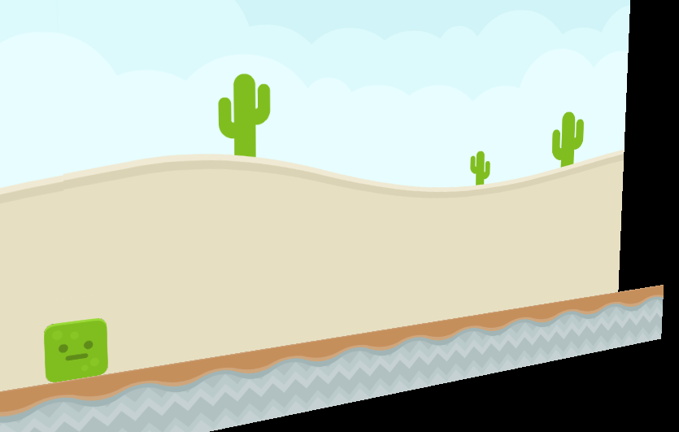
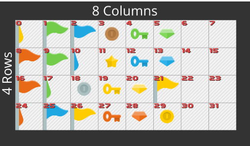
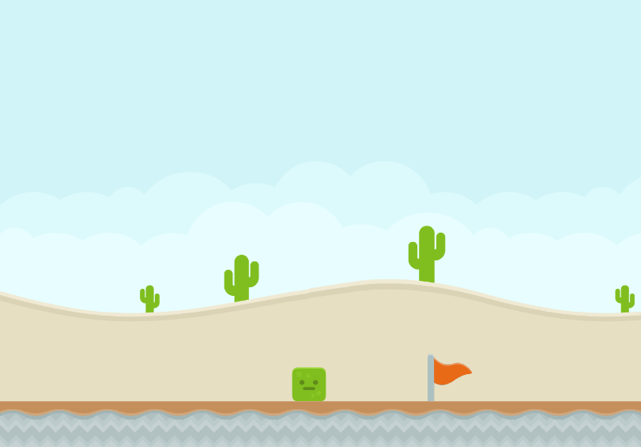

# Galago2D
Galago 2D is a set of classes that can be used to develop a 2D game in jMonkeyEngine3.3.
It is a mapping library for jME3.3 to Dyn4J. 

It allows the user to create sprite images and add them to
the scene as well as adding a RigidBodyControl2D to a sprite for giving that sprite physics properties.


**Some features this library provides:**
1. Sprite Mesh
2. Sprite Animation Control
3. Dyn4jAppState for 2D physics world
4. Variety of collision shapes (BoxCollisionShape, CircleCollisionShape, EllipseCollisionShape, etc.)
5. Joints (Connect RigidBodies to one another with joints, RopeJoint, HingeJoint, FrictionJoint, DistanceJoint)
6. Vehicle support
7. Camera2DState which will set the camera in a 2D mode allowing Orthographical rendering
8. PlatformerCharacterControlState for controlling a character in 2D space.

## Example1:
In Example 1 I will show you how to create sprite meshes and add them to the root scene. 
You will also see the best way of how to apply an unshaded material to a sprite.

```java
package com.galago.sprite.example1;

import com.galago.sprite.Sprite;
import com.jme3.app.SimpleApplication;
import com.jme3.asset.TextureKey;
import com.jme3.material.Material;
import com.jme3.material.RenderState;
import com.jme3.math.Vector2f;
import com.jme3.renderer.queue.RenderQueue;
import com.jme3.scene.Geometry;
import com.jme3.texture.Texture;

/**
 * This example will show you how to create simple sprites for the background,
 * floor and player.
 *
 *
 * @author NickideBruyn
 */
public class Example1 extends SimpleApplication {

    private Geometry player;     //The player spatial object
    private Geometry background; //The background spatial
    private Geometry floor;      //The floor

    /**
     * The main method for this java app when we run it.
     * @param args 
     */
    public static void main(String[] args) {
        Example1 app = new Example1();
        app.start();
    }

    @Override
    public void simpleInitApp() {

        //Load the background
        Sprite backgroundSprite = new Sprite(20, 10);
        background = new Geometry("background", backgroundSprite);
        Material material = loadMaterial("Textures/colored_desert.png");
        background.setMaterial(material);
        backgroundSprite.scaleTextureCoordinates(new Vector2f(2, 1));
        rootNode.attachChild(background);
        background.move(0, 0, -1);

        //Load the floor
        Sprite floorSprite = new Sprite(20, 1);
        floor = new Geometry("floor", floorSprite);
        material = loadMaterial("Textures/dirtMid.png");
        floor.setMaterial(material);
        floorSprite.scaleTextureCoordinates(new Vector2f(20, 1));
        rootNode.attachChild(floor);
        floor.move(0, -4f, 0);

        //Load the player
        Sprite playerSprite = new Sprite(1, 1);
        player = new Geometry("player", playerSprite);
        material = loadMaterial("Textures/slimeBlock.png");
        player.setMaterial(material);
        player.setQueueBucket(RenderQueue.Bucket.Transparent);
        rootNode.attachChild(player);
        player.move(0, -3f, 0);
    }

    /**
     * Local method for reuse of loading a texture as an unshaded material
     *
     * @param file
     * @return
     */
    protected Material loadMaterial(String file) {
        Material mat = new Material(assetManager, "Common/MatDefs/Misc/Unshaded.j3md");
        Texture tex = assetManager.loadTexture(new TextureKey(file, false));
        tex.setWrap(Texture.WrapMode.Repeat);
        mat.setTexture("ColorMap", tex);
        mat.getAdditionalRenderState().setBlendMode(RenderState.BlendMode.Alpha);
        return mat;
    }
}

```
It will look something like this.


## Example2:
We will now look at how one can add these sprite spatial's to a 2D physics space.

### Step1: Setting up the physics space
First we need to create a Dyn4jAppState and attach it to the state manager.
```java
        dyn4jAppState = new Dyn4jAppState();
        stateManager.attach(dyn4jAppState);
```

### Step2: Adding physics to static floor
Next we will create a RigidBodyControl2D with 0 mass and add it to the physics space.
```java
        //For the floor sprite it will be a static body with 0 mass
        RigidBodyControl2D rbcFloor = new RigidBodyControl2D(new BoxCollisionShape(floorSprite.getWidth(), floorSprite.getHeight()), 0);
        //Attach the control to the spatial
        floor.addControl(rbcFloor);
        //Add the rigid body to the physics space        
        dyn4jAppState.getPhysicsSpace().add(rbcFloor);
        //Move the rigid body to the desired position
        rbcFloor.move(0, -4f);        
```


### Step3: Add physics to the player sprite
Then finally in example2 we will create a rigidbody with mass and add it to the physics space.
```java
        //The player rigid body will have mass so that it can be affected by gravity
        RigidBodyControl2D rbcPlayer = new RigidBodyControl2D(new CircleCollisionShape(0.5f), 1);
        //Add the control to the player spatial
        player.addControl(rbcPlayer);
        //Add it to the physics space
        dyn4jAppState.getPhysicsSpace().add(rbcPlayer);
        //Now we can move it to a start position
        rbcPlayer.move(0, 1);
        //Adjust the player's gravity
        rbcPlayer.setGravityScale(2);
```

## Example3:
This example will show you how to add platformer character control app state to the game.
For convenience Galago2D comes with a very handy and out of the box 2D character control app state.
It gives the user the ability to control the characters movement and gives it a left, right, jump, attack and interact behaviour.
And it is very simple to use. The next piece of code is all you need to get this behaviour.

```java
        //Example3-Step1
        platformerCharacterControlState = new PlatformerCharacterControlState(dyn4jAppState, player);
        stateManager.attach(platformerCharacterControlState);
```
You will notice that when you control the character the camera also moves along and that is 
because the default fly camera is still active which is part of the SimpleApplication you extended.
In the next example you will see how to fix this problem.



## Example4: 
In example 4 we will look at fixing the camera to be in 2D space.
Fortunately it is also very easy to do and Galago2D provides you with such a class.
The Camera2DState class will disable the fly cam, set the camera in orthographical view 
and lock movement of the camera to the target spatial.

```java
        //Example4-Step1: Create the camera2Dstate and give it a distance and movement interpolation amount
        camera2DState = new Camera2DState(player, 6, 0.01f);
        //Set camera clipping which will block the camera from moving a certain min and max value on the x and y axis
        camera2DState.setCameraClipping(new Vector2f(-2f, 0), new Vector2f(2f, 1));
        //You can also set a camera to player offset. Move the camera to stick above the player 2f in the y axis
        camera2DState.setTargetOffset(new Vector2f(0, 2));
        //Attach the camera2Dstate to the state manager
        stateManager.attach(camera2DState);
```

## Example5: 
In example 5 we will look at how we can add animated sprites to the scene and setup specific animations.
This is done by the SpriteAnimationControl which can be added to the flag spatial.
The basic idea of this control is to setup a sequence of indexes per animation which will be looped over at runtime and rendered accordingly.

If you look at the image below you can see how many columns and rows exist in the used texture. Also each tile contains an index.
This index is very important because that is the index which will be used when doing an animation.



We will add the orange flag to the scene and animated it.
Here is the code for doing that.

```java
        //Example5: Add an animated character to the scene
        Sprite flagSprite = new Sprite(1, 1, 8, 4, 0, 1);
        Geometry flag = new Geometry("flag", flagSprite);
        Material flagMat = loadMaterial("Textures/spritesheet_items.png");
        //Important to note, the face culling for animated sprites need to be off
        flagMat.getAdditionalRenderState().setFaceCullMode(RenderState.FaceCullMode.Off);
        flag.setMaterial(flagMat);
        flag.setQueueBucket(RenderQueue.Bucket.Transparent);
        flag.move(3, -3, 0);
        rootNode.attachChild(flag);
        
        //Here we instanciate the animation control
        SpriteAnimationControl spriteAnimationControl = new SpriteAnimationControl(flagSprite);
        //Setup a simple animation making use of a sequence of tile indexes
        spriteAnimationControl.addAnimation("idle", new int[] {8, 16});
        flag.addControl(spriteAnimationControl);
        
        //Finally we need to play the desired animation
        spriteAnimationControl.playAnimation("idle", 0.15f);
```

And that is it. The final game will look like this.


